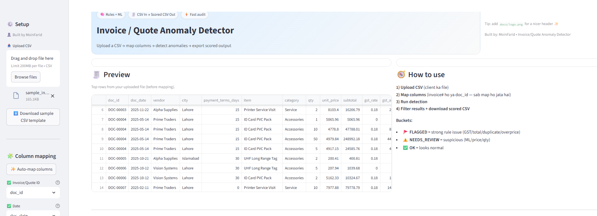
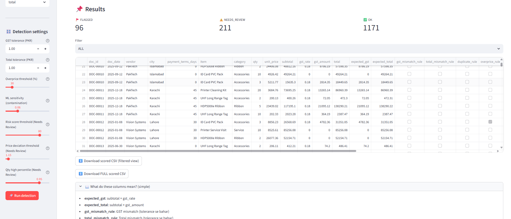

# Invoice / Quote Anomaly Detector (Rules + ML Triage)

Upload a CSV → auto-detect suspicious invoices/quotes → export a scored output.

This app combines:
- **Business rules** (GST mismatch, total mismatch, overpricing, duplicate)
- **ML triage** (Isolation Forest) to surface “weird-but-not-proven” cases via **NEEDS_REVIEW**

**Live Demo:** https://invoice-quote-anomaly-detector.streamlit.app/  
**GitHub Repo:** https://github.com/moinfarid-star/invoice-quote-anomaly-detector  
**Built by:** MoinFarid

> ⚠️ Important: Do **not** upload sensitive/client data to a public repo.

---

## Screenshots




---

## What problem does this solve?

Finance / procurement teams waste time manually checking:
- Wrong totals
- GST mistakes
- Overpriced line items
- Duplicate invoices/quotes

This app helps you:
- **Flag** high-risk rows fast
- Put uncertain cases into **NEEDS_REVIEW**
- Mark the rest as **OK**
- Export a clean, scored CSV for audit/review

---

## Output labels (FLAGGED / NEEDS_REVIEW / OK)

### ✅ OK
No strong issues found.

### ⚠️ NEEDS_REVIEW
Not clearly wrong, but the ML score and/or price deviation looks suspicious.  
Good for a quick human check.

### 🚩 FLAGGED
Strong signals (rules) indicate a likely anomaly (GST mismatch, total mismatch, duplicate, overprice).  
High priority.

---

## How it works (simple)

### Step 1: Column mapping
Client files can have different column names (e.g., `invoice_no` instead of `doc_id`).  
In the app, you map each required field to the correct column.

### Step 2: Rules engine
The app computes:
- **expected_gst** = `subtotal * gst_rate`
- **expected_total** = `subtotal + gst_amount`

Rules:
- **gst_mismatch_rule** → gst_amount doesn’t match expected_gst (within tolerance)
- **total_mismatch_rule** → total doesn’t match expected_total (within tolerance)
- **duplicate_rule** → repeated document id + item + amounts (config dependent)
- **overprice_rule** → unit_price far higher than vendor/item baseline

### Step 3: ML triage (Isolation Forest)
The model assigns an anomaly score based on numeric patterns.  
It can surface unusual pricing behavior even when rules don’t fire.

### Step 4: Final decision
- If **any rule triggers** → `final_status = FLAGGED`
- Else if ML score and/or price deviation crosses thresholds → `final_status = NEEDS_REVIEW`
- Else → `final_status = OK`

---

## Required columns (minimum)

Your CSV must contain these fields (names can differ; you map them in the app):

- `doc_id` (or invoice_no / quote_no)
- `doc_date` (YYYY-MM-DD recommended)
- `vendor`
- `item`
- `qty`
- `unit_price`
- `subtotal`
- `gst_rate`
- `gst_amount`
- `total`

Optional (useful if available):
- `city`
- `payment_terms_days`
- `category`

### Date format
Recommended: `YYYY-MM-DD`  
Example: `2025-02-02`

---

## Detection settings (sidebar)

Typical settings:
- **GST tolerance** (handles rounding, e.g., ±1 PKR)
- **Total tolerance** (same idea for total rounding)
- **Overprice threshold** (how aggressive to flag expensive items)
- **ML risk threshold** (higher = fewer false alarms, may miss anomalies)
- **Needs Review threshold** (middle bucket for manual check)

Tip: start conservative, then tune using feedback (reduce false positives first).

---

## Run locally

### 1) Install dependencies
```bash
python -m pip install -r requirements.txt
